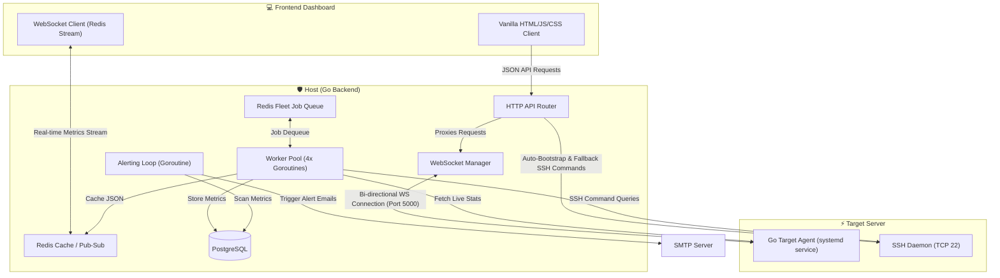

# 🖥️ Cluster Monitor

Cluster Monitor is a high-performance, enterprise-ready cluster and server orchestration system built in **Go**. It provides real-time telemetry, Docker container management, systemd service control, and custom script execution across remote server fleets. 

It is designed with a **hybrid architecture** that supports both a zero-dependency **Agentless SSH fallback** and a high-performance, bi-directional **WebSocket Agent** mode.

---

## 🏗️ Architecture Overview



---

## 🌟 Key Features

### 🔌 Dual-Mode Remote Monitoring
- **WebSocket Agent Mode:** Remote servers run a lightweight Go client (`cluster-target`) configured as a systemd user service. The agent registers with the host and opens an egress WebSocket connection, sending metrics every **5 seconds** and executing server commands in real-time.
- **Agentless SSH Fallback:** If the agent is offline or unregistered, the host automatically falls back to secure SSH execution—running CLI utilities (e.g., `ps`, `df`, `ss`) and parsing raw stdout into structured JSON, guaranteeing 100% uptime monitoring.

### 🚀 Zero-Touch SSH Bootstrapping
- Register remote servers simply by providing SSH credentials or key files.
- The host automatically connects, compiles the target agent binary, copies it over via secure `scp`, registers/enables it as a `systemd` user service, and establishes the real-time WebSocket tunnel automatically.

### 📊 Comprehensive Fleet Control & Telemetry
- **Hardware Telemetry:** Real-time graphs for CPU core load, physical RAM and Swap usage, disk space (df partition maps), and network interface TX/RX speeds.
- **Process Manager:** Real-time processes tree (`ps`), sorting by CPU/RAM usage, and remote process-level controls (e.g., sending SIGTERM/SIGKILL signals to specific PIDs or process names).
- **Docker Orchestrator:** Complete container panel to inspect running/stopped containers, stream resource metrics, perform lifecycle actions (Start, Stop, Restart, Remove), and run new containers from images remotely.
- **Network connections auditor:** Inspects active network sockets, local/remote IPs, and TCP connection states (ESTABLISHED, LISTEN, etc.).
- **systemd Controller:** Remotely inspect, start, stop, restart, enable, or disable systemd services on target machines.
- **Custom Scripts Group:** Define groups of shell scripts and custom commands that can be executed concurrently on selected target groups with standard output piped back to the dashboard.

### 🛡️ Role-Based Access Control (RBAC) & Team Collaboration
- Invite team members to collaborate on specific server views.
- Assign roles (Admin, Member, Viewer) with fine-grained restrictions on tab access, application groups, process control actions (e.g., allow viewing but restrict process killing), and Docker operations.

### 🚨 Real-time Alerts & Redis Job Queue
- Background alert evaluation engine running a dedicated goroutine loop.
- Trigger SMTP email notifications when customizable metric thresholds are crossed (e.g., CPU > 90% for 5 mins), automatically resolving alerts and updating DB flags when thresholds stabilize.
- Built-in Redis-backed **Job Queue** (modeled after BullMQ) utilizing a worker pool of **4 concurrent goroutine workers** to fetch server stats periodically without bottlenecking API routing.
- Auto-pruning routine that clears metrics older than retention periods to optimize PostgreSQL storage.

---

## 🛠️ Technology Stack

- **Backend & Target Agent:** Go (Golang) with Gorilla WebSockets, `golang.org/x/crypto/ssh`, and `lib/pq` (PostgreSQL driver).
- **Caching & Messaging:** Redis 7 (Cache layer, Pub/Sub metrics streaming, Queue storage).
- **Database:** PostgreSQL 15 (Relational storage for server inventory, users, RBAC, alert rules, and historical telemetry).
- **Frontend Dashboard:** Vanilla HTML5, CSS3 (Modern, responsive Dark Mode grid layout), vanilla JavaScript (SSE, WebSocket events, Chart.js/Canvas representation).
- **Service Management:** `systemd` (Target agent service lifecycle).

---

## 📂 Project Structure

```
├── cluster-host/                  # Host Backend & Web Dashboard Code
│   ├── backend/                   # Go-based API host
│   │   ├── agent_assets/          # Auto-compiling assets for SSH bootstrap
│   │   ├── Dockerfile             # Container definition for Host API
│   │   ├── main.go                # API routes, Auth, DB schema & Alert Loops
│   │   ├── redis.go               # Caching layer & Pub/Sub streams
│   │   ├── ssh.go                 # SSH client config, fallback execution & scp logic
│   │   ├── websocket.go           # Agent WebSocket server & Command Forwarder
│   │   └── worker.go              # Redis concurrent Job Queue & Fleet worker pool
│   ├── frontend/                  # Web Dashboard assets (served via Node server)
│   │   ├── public/                # HTML pages, CSS files, and JS graphs
│   │   └── server.js              # Minimal Node web server
│   └── docker-compose.yml         # Dev cluster runtime (PG, Redis, API, Client)
│
├── cluster-target/                # Telemetry Agent source (deployed to target servers)
│   ├── cluster-target.service     # systemd system unit template
│   ├── main.go                # Telemetry collector, System CLI parser & WS client
│   └── reinstall.sh               # Local setup & uninstallation scripts
```

---

## 🚀 Getting Started

### 📋 Prerequisites
- **Docker & Docker Compose** installed locally.
- A running SMTP relay server (e.g., Gmail SMTP) for email alerts.
- GitHub OAuth application configured (for team OAuth logins).

### ⚙️ Host Setup & Execution
1. Clone the repository:
   ```bash
   git clone https://github.com/DevAyyan/Cluster-Monitor.git
   cd Cluster-Monitor/cluster-host
   ```
2. Create your environment configuration:
   ```bash
   cp .env.example .env
   ```
3. Update the `.env` file with your credentials (PostgreSQL passwords, SMTP server keys, and GitHub Client Secret keys).
4. Run the entire host cluster stack using Docker Compose:
   ```bash
   docker compose up --build -d
   ```
5. Open your browser and navigate to `http://localhost:8082` to access the Cluster Monitor panel.

### 🔌 Registering a Target Server
To monitor a remote machine:
1. Log into the Host Panel and click **Add Server**.
2. Input the remote IP address, SSH Port, User, and SSH Private Key (or Password).
3. Click **Bootstrap Server**.
4. The host backend will automatically connect via SSH, compile the agent for the target OS, copy it over, register it as a user-level `systemd` service, and establish the real-time metrics websocket stream.

---

## 🔒 Security Practices
- **Egress-only WebSockets:** Target agents connect outward to the host. No open ports are required on remote agent firewalls except standard SSH.
- **Strict Service Isolation:** The target agent service is sandboxed in `systemd` with strict environment restrictions (`ProtectHome=true`, `ProtectSystem=strict`).
- **Granular RBAC:** Server actions (process termination, container deployment) require verified token credentials mapped dynamically to specific tenant IDs in PostgreSQL.

---

## 📄 License
This project is open-source and licensed under the MIT License.
