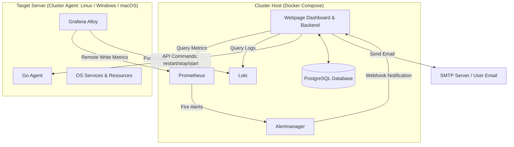

# Cluster Monitor Implementation Plan

This document outlines the architecture, database schema, component specifications, and step-by-step implementation plan for the **Cluster Monitor** system. Cluster Monitor is a lightweight system-monitor dashboard designed to track system resources (CPU, RAM, Disk) and service state (systemd units, Windows services, launchd agents, system logs, etc.) across multiple remote Linux, Windows, and macOS (Darwin) servers.

---

## 1. System Architecture Overview

The system consists of two primary components:
1. **Cluster Host**: The central management server, running inside Docker Compose. It aggregates metrics/logs, stores server metadata in **PostgreSQL**, runs a dashboard UI, and routes email alerts.
2. **Cluster Agent**: A set of lightweight processes running on target servers. This includes **Grafana Alloy** (for telemetry collection and shipping) and the **Go Agent** (for service control and command execution), fully compatible with Linux, Windows, and macOS.

### High-Level Architecture Diagram



---

## 2. Architectural Audit & Security Improvements

Before proceeding, we have audited the initial system design. Here are the key security and structural improvements integrated into this plan:

### 1. Secure Cross-Platform Go Agent Command Execution (No Shell Injection)
* **Risk**: The Go agent receives instructions to start, stop, or restart system services. If the agent accepts arbitrary string commands and runs them in a shell (e.g., `bash -c` or cmd shell), it introduces a major Remote Code Execution (RCE) vulnerability.
* **Mitigation**:
  * The Go agent API will only accept structured JSON payloads detailing the **action** (strictly validated against an enum: `start`, `stop`, `restart`, `status`) and the **service** (sanitized to alphanumeric characters, dashes, dots, and underscores).
  * **Dynamic OS Detection**: The Go agent uses Go's `runtime.GOOS` to identify the operating system and invokes the OS-specific service manager directly (avoiding shell wrappers):
    * **Linux**: `exec.Command("sudo", "systemctl", action, service)`
    * **Windows**: `exec.Command("powershell.exe", "-Command", "Action-Service -Name Service")` (with pre-mapped action enums)
    * **macOS**: `exec.Command("launchctl", subcommand, service)`
  * Permissions are restricted appropriately per OS (e.g. `/etc/sudoers.d/clusteragent` on Linux, running under a restricted service account on Windows).

### 2. Network Security & Firewall Traversal (Push vs. Pull)
* **Risk**: Scraping metrics by pulling them from agents requires the Host to open inbound TCP ports on every target server. This is problematic if agents are behind NAT, dynamic IPs, or firewalls.
* **Mitigation**:
  * **Prometheus Remote Write**: We will configure Grafana Alloy to scrape metrics locally and *push* them to the Host's Prometheus remote-write receiver (started with `--web.enable-remote-write-receiver`).
  * **Loki Logs**: Grafana Alloy pushes logs directly to Loki's API (`/loki/api/v1/push`).
  * **Outcome**: Target servers do not need to expose any ports for telemetry. They only need outbound access to the Cluster Host port. The only inbound port exposed on target agents will be the Go Agent control port (`9191`), which should be firewalled to accept requests *only* from the Host IP, and must be secured via TLS with a shared Bearer Token.

### 3. Dynamic and Secure Alerting Workflow
* **Risk**: Writing Alertmanager/Prometheus alerting rule files dynamically at runtime is complex and prone to breaking Prometheus configuration.
* **Mitigation**:
  * **PostgreSQL + Backend Dispatch**: The Host Web UI will save alert configurations (e.g., `CPU > 90% for 5m`) in PostgreSQL. 
  * The Host Backend will run a lightweight cron evaluator that queries Prometheus' API (`/api/v1/query?query=...`) and matches results against user thresholds.
  * If a threshold is crossed, the backend handles sending emails immediately. This completely avoids the complexity of dynamic YAML config writing and keeps the alerting stack robust, fast, and simple to debug.

### 4. Local Area Network (LAN) Routing Option
* **LAN/Private IP Routing**: Since the Host and Agents reside on the same local network (LAN) or a unified private subnet, they communicate directly via local IP addresses. This avoids exposing any ports to the public internet and eliminates the need for external VPN configuration.

---

## 3. Database Schema (PostgreSQL)

The Host will use a PostgreSQL database (`cluster_monitor`) to manage server inventory, dynamic tracking states, and alert rules.

```sql
-- Enable UUID extension if needed
CREATE EXTENSION IF NOT EXISTS "uuid-ossp";

-- Table: servers
CREATE TABLE IF NOT EXISTS servers (
    id UUID PRIMARY KEY,               -- UUID v4
    hostname VARCHAR(255) NOT NULL,    -- Hostname of the agent machine
    ip_address VARCHAR(45) NOT NULL,   -- IP address of the agent (supports IPv4/IPv6)
    os_family VARCHAR(50) NOT NULL,    -- 'linux', 'windows', 'darwin'
    agent_token VARCHAR(255) NOT NULL, -- Secure API token shared between Host and Go Agent
    status VARCHAR(50) DEFAULT 'unknown', -- 'online', 'offline', 'warning', 'unknown'
    last_seen TIMESTAMP DEFAULT CURRENT_TIMESTAMP,
    created_at TIMESTAMP DEFAULT CURRENT_TIMESTAMP
);

-- Table: monitored_services
-- Tracks which services on which servers to monitor or ignore in the UI
CREATE TABLE IF NOT EXISTS monitored_services (
    id SERIAL PRIMARY KEY,
    server_id UUID NOT NULL,
    service_name VARCHAR(255) NOT NULL, -- systemd unit, Windows service name, or launchd label
    is_tracked BOOLEAN DEFAULT TRUE,    -- True = Tracked, False = Ignored
    FOREIGN KEY(server_id) REFERENCES servers(id) ON DELETE CASCADE,
    CONSTRAINT unique_server_service UNIQUE(server_id, service_name)
);

-- Table: alert_rules
-- Dynamic user-defined alerts configured via the dashboard
CREATE TABLE IF NOT EXISTS alert_rules (
    id SERIAL PRIMARY KEY,
    server_id UUID NOT NULL,
    metric_type VARCHAR(50) NOT NULL,  -- 'cpu', 'ram', 'disk'
    operator VARCHAR(5) DEFAULT '>',   -- '>', '<'
    threshold REAL NOT NULL,           -- Percentage (e.g., 90.0)
    duration_minutes INTEGER DEFAULT 5, -- How long threshold is exceeded before alert
    recipient_email VARCHAR(255) NOT NULL, -- Destination email
    is_active BOOLEAN DEFAULT TRUE,    -- True = Enabled, False = Disabled
    last_triggered TIMESTAMP,          -- Avoid spamming emails
    FOREIGN KEY(server_id) REFERENCES servers(id) ON DELETE CASCADE
);

-- Table: recently_viewed
-- Stores the audit trail of recently clicked/viewed servers for dashboard quick access
CREATE TABLE IF NOT EXISTS recently_viewed (
    id SERIAL PRIMARY KEY,
    server_id UUID NOT NULL,
    viewed_at TIMESTAMP DEFAULT CURRENT_TIMESTAMP,
    FOREIGN KEY(server_id) REFERENCES servers(id) ON DELETE CASCADE
);
```

---

## 4. Component Details & Setup

### Cluster Host (Docker Compose)
The Host will run in a single Docker Compose stack:
* **Host Backend & Dashboard**: A backend serving a Vite/Vanilla JS frontend. Exposes port `8080` (HTTP). It interfaces with PostgreSQL, Prometheus API, Loki API, and communicates with Go Agents.
* **PostgreSQL**: Runs in a container with a persistent volume to store cluster metadata, configurations, and logs.
* **Prometheus**: Runs with `--web.enable-remote-write-receiver`. Stores metrics.
* **Loki**: Stores logs shipped by Grafana Alloy.
* **Alertmanager**: Optional routing of host-level warnings.

### Cluster Agent
Installed on each target server:
* **Grafana Alloy**: Configured with an OS-appropriate `.alloy` script to collect OS-specific resources and logs:
  * **Linux**: Collects node metrics, systemd units, and journal logs.
  * **Windows**: Collects Windows performance counters, Windows service status, and Event Logs.
  * **macOS**: Collects node metrics and local syslog files.
  * Pushes to Host's Prometheus and Loki endpoints.
* **Go Agent**: Runs as an OS background service. Exposes port `9191` (HTTPS) with bearer-token auth. Executes OS-specific commands safely to start, stop, or restart services.

---

## 5. API Design & Communication

### Agent Registration (First Boot)
When an agent is deployed, it registers with the Host:
1. Agent makes a `POST /api/register` request containing its hostname, OS family, and dynamic IP.
2. Host Backend verifies a registration token, inserts the server into PostgreSQL, and generates a unique `agent_token`.
3. Host returns the `agent_token` and Grafana Alloy config templates containing the host IP and credentials.

### Service Control API (Host -> Go Agent)
* **Endpoint**: `POST https://<agent-ip>:9191/api/v1/service/control`
* **Headers**: `Authorization: Bearer <agent_token>`
* **Payload**:
  ```json
  {
    "service": "nginx", // Or Windows service like "wuauserv", launchd plist "com.example.app"
    "action": "restart"
  }
  ```
* **Response**:
  ```json
  {
    "status": "success",
    "output": "Service nginx restarted successfully."
  }
  ```

---

## 6. Implementation Roadmap

### Phase 1: Docker Host Infrastructure
1. Draft the `docker-compose.yml` for Cluster Host (PostgreSQL, Prometheus, Loki, Alertmanager, Host Backend skeleton).
2. Configure Prometheus with remote write enabled (`--web.enable-remote-write-receiver`).
3. Set up Loki's storage directory structure.

### Phase 2: Agent Design & Cross-Platform Go Agent Coding
1. Create the Go agent directory structure.
2. Write the Go agent HTTP server with Bearer Token middleware.
3. Implement `runtime.GOOS` conditional logic and safe command wrappers (`exec.Command`) for systemd, powershell, and launchctl.
4. Document agent service setup and system service configurations per OS (`README.md`).

### Phase 3: Grafana Alloy Configuration
1. Draft the `config.alloy.linux`, `config.alloy.windows`, and `config.alloy.macos` configuration files for system telemetry.
2. Define scraping blocks for CPU, RAM, Disk, and service states corresponding to each OS.
3. Configure Loki logging blocks (Journald logs for Linux, Event logs for Windows, Syslog file for macOS).

### Phase 4: Host Backend & PostgreSQL Integration
1. Write the Host Backend with PostgreSQL connection and initialization.
2. Implement APIs for metric queries (proxying Prometheus), log queries (proxying Loki), server registration, and service control.
3. Add the alerting engine loop that periodically checks thresholds and sends SMTP emails.

### Phase 5: Dashboard Frontend UI
1. Build the dashboard UI using modern, premium layout rules (collapsible sidebar, dark mode, high-fidelity metrics widgets).
2. Wire system monitor components (gauge charts, service statuses, toggles).
3. Connect alert rule configuration interfaces.

---

## 7. Security Best Practices Summary

* **mTLS/Tokens**: Encrypt Host-to-Agent requests using self-signed TLS certificates and validate Bearer Tokens on every command request.
* **Privilege Separation**: Limit service runner accounts. Use restricted sudo configs on Linux, service permission configurations on Windows, and launchd plist definitions on macOS.
* **Private Network**: Restrict Go Agent ports (e.g., `9191`) using firewalls (UFW/iptables, Windows Advanced Firewall) so they only accept traffic from the Host IP, or route traffic entirely through the private LAN/subnet.
* **Secure Inputs**: Validate service names against alphanumeric character limit lists before passing to shell exec.
